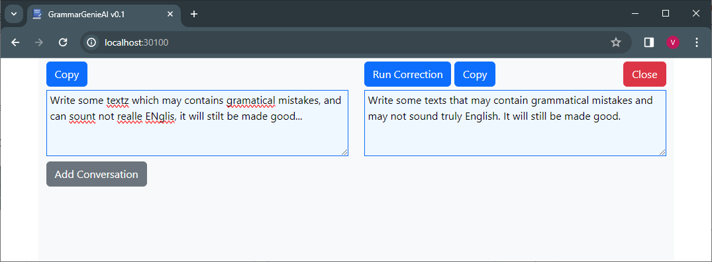

# Grammar Checker and Corrector App
The Grammar Checker and Corrector is a Web App based on the [OpenAI Chat Completions API](https://platform.openai.com/docs/guides/text-generation).

## Screenshots


## Usage
To be announced...

## Local Installation

1. To install, follow these steps:
```bash
git clone https://github.com/aformusatii/GrammarGenieAI.git
cd GrammarGenieAI

# Install all nodejs dependencies
npm install
```

2. Create a `.env` file in the root folder `GrammarGenieAI`, include your `OPENAI_API_KEY` like this:
```bash
OPENAI_API_KEY=your_openapi_api_key
```

3. To start the server:
```bash
# From the GrammarGenieAI folder
node server.js
```

4. Open the app web page by navigating to [http://localhost:30100/](http://localhost:30100/). If you're accessing it from a remote machine, replace `localhost` with your IP.


